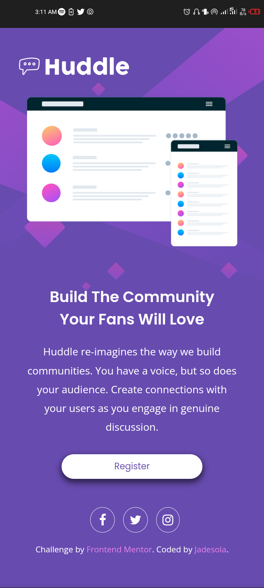

# Frontend Mentor - Huddle landing page with single introductory section solution

This is a solution to the [Huddle landing page with single introductory section challenge on Frontend Mentor](https://www.frontendmentor.io/challenges/huddle-landing-page-with-a-single-introductory-section-B_2Wvxgi0). Frontend Mentor challenges help you improve your coding skills by building realistic projects. 

## Table of contents

- [Overview](#overview)
  - [The challenge](#the-challenge)
  - [Screenshot](#screenshot)
  - [Links](#links)
- [My process](#my-process)
  - [Built with](#built-with)
  - [What I learned](#what-i-learned)
  - [Continued development](#continued-development)
- [Author](#author)

**Note: Delete this note and update the table of contents based on what sections you keep.**

## Overview

### The challenge

Users should be able to:

- View the optimal layout for the page depending on their device's screen size
- See hover states for all interactive elements on the page

### Screenshot

 (Web)


(Mobile)

### Links

- Solution URL: [Add solution URL here](https://github.com/jadesolayo/huddle-landing-page.github.io)
- Live Site URL: [Add live site URL here](https://huddle-landing-page-by-jade.netlify.app/)

## My process

### Built with

- Semantic HTML5 markup
- CSS custom properties
- Flexbox
- Desktop-first workflow

### What I learned

While working on this project, I had abetter idea of how to work with CSS Flexbox which I used to create the two-column layout.

I learnt about css media query which i used to create the mobile responsive design.

I learnt how to center a button by putting the button in a div and giving the div a property of (text-align:center).

```html
 <div class="reg-btn"><button>Register</button></div>
 ```
```css
 .reg-btn {
    margin-top: 10px;
    text-align: center;
  }
```
I learnt how to use the pseudo before and after element to give a border to the icons. I also learnt how to embed icons in your project by downloading the font-pack and linking it to the head tag of the html element.

### Continued development

in future projects i'd love to implement more media queries and also learn mobile first responsive design.I'd also learn to use flexbox more to create a more responsive design.

## Author

- Website - [@jadesolayo](https://github.com/jadesolayo)
- Frontend Mentor - [@jadesolayo](https://www.frontendmentor.io/profile/jadesolayo)
- Twitter - [@jade_babyyyyy](https://www.twitter.com/jade_babyyyyy)

